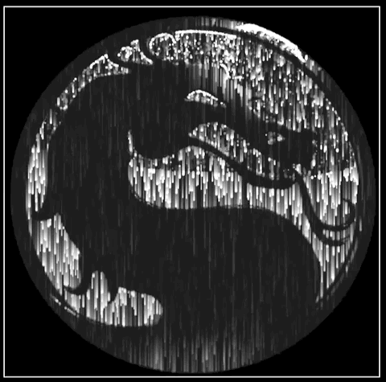

# Pixel Rain 👾

A small demo javascript experiment which shows falling pixels with their speed mapped to the original images brightness.

We split the image into coloured RGBA pixels and use these values to calculate a human percieved lightness value which is then used to adjust the speed of a travelling pixel.

# Getting started
To run this just clone the project and open the index.html file.

## TODO

Some thoughts for the future 🤔

- Add some buttons to show different effects (there are some very interesting changing when tweaking the "magic" numbers).
- Need to tweak the logic so it can work with any image. (transparent images cause issues.)
- Ability to upload a new image.

